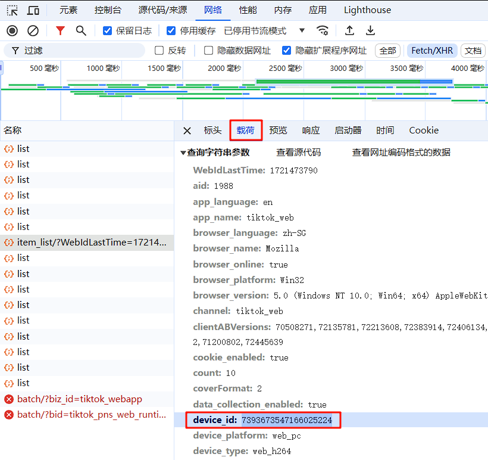

# Downloader

Downloader 是一个跨平台的抖音视频下载器，目前支持 macOS 与 windows，并具有音视频转码功能。

**由 Tauri@2.0 + Rust + React + Typescript 开发**

## 项目代码规范

- 使用 tauri 2.0 跨平台构建
- 使用 rust 进行后端开发
- 使用 vite + react + typescript + tailwindcss 进行前端开发
- 使用 eslint + prettier 规范前端代码
- 使用 [shadcn-ui](https://ui.shadcn.com/examples) 组件库
- 使用 jotai-immer 前端状态管理

## 下载安装

[下载](https://github.com/gelove/downloader/releases)最新版本的安装包，解压后运行安装程序即可。

## 手动编译

**如需手动编译，请确保已安装 Rust 与 Typescript 开发环境。**

### 需要安装 ffmpeg 才能正常运行，请根据系统架构安装对应的 ffmpeg 可执行文件。

[ffmpeg macOS_arm64](https://github.com/gelove/downloader/releases/download/ffmpeg/ffmpeg-aarch64-apple-darwin)

[ffmpeg macOS_x86_64](https://github.com/gelove/downloader/releases/download/ffmpeg/ffmpeg-x86_64-apple-darwin)

[ffmpeg windows_x86_64](https://github.com/gelove/downloader/releases/download/ffmpeg/ffmpeg.exe)

[ffmpeg MacOS_arm64](https://osxexperts.net/)

[ffmpeg MacOS_x86_64](https://evermeet.cx/ffmpeg/ffmpeg-7.1.zip)

[ffmpeg windows_x86_64](https://www.gyan.dev/ffmpeg/builds/packages/ffmpeg-7.1-essentials_build.zip)

```shell
# clone 项目
git clone https://github.com/gelove/downloader.git
# 切换到项目目录
cd downloader
# 安装前端依赖
pnpm i

# 将 ffmpeg 可执行文件复制到项目目录
# macOS 平台将 ffmpeg 作为 sidecar 打包到程序中
cp ffmpeg-aarch64-apple-darwin ./src-tauri/bin/ffmpeg-aarch64-apple-darwin
cp ffmpeg-x86_64-apple-darwin ./src-tauri/bin/ffmpeg-x86_64-apple-darwin
# windows 平台将 ffmpeg 作为资源文件打包到程序中
cp ffmpeg.exe ./src-tauri/bin/windows/ffmpeg.exe

# 创建 tauri 程序密钥, 自动更新插件需要, 如不需要在 Tauri.toml 中注释掉
# ~/.tauri/downloader.key 私钥
# ~/.tauri/downloader.key.pub 公钥
cargo tauri signer generate -w ~/.tauri/downloader.key
# 更新 logo
cargo tauri icon ./public/logo.png
# 启动项目
cargo tauri dev --verbose
# 打包构建
cargo tauri build
```

## Cookie 获取教程

本教程仅演示部分能够获取所需 **_Cookie_** 的方法，仍有其他方法能够获取所需 **_Cookie_**；本教程使用的浏览器为 **_Microsoft Edge_**
，部分浏览器的开发人员工具可能不支持中文语言。

### 方法

1. 打开浏览器，访问 [抖音](https://www.douyin.com)
2. 登录抖音账号
3. 按 **_F12_** 打开开发人员工具
4. 选择 **_网络_** 选项卡
5. 勾选 **_保留日志_**
6. 在 **_筛选器_** 输入框输入 **_cookie-name:odin_tt_**
7. 访问 **_抖音网页版_** 中任意用户主页 或者访问 [关注页](https://www.douyin.com/follow)
8. 在开发人员工具窗口选择任意一个数据包\(如果无数据包，重复步骤7\)
9. 全选并复制 **_Cookie_** 的值
10. 运行程序 ，根据提示写入 **_Cookie_**

### 截图示例


### device_id 参数

**_device_id_** 参数获取方法与 Cookie 类似。



## 已知问题

- MacOS环境下, 中文输入法会导致选择下拉框关闭时需要轻点两次触摸板
