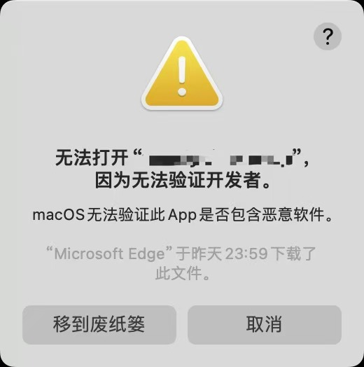
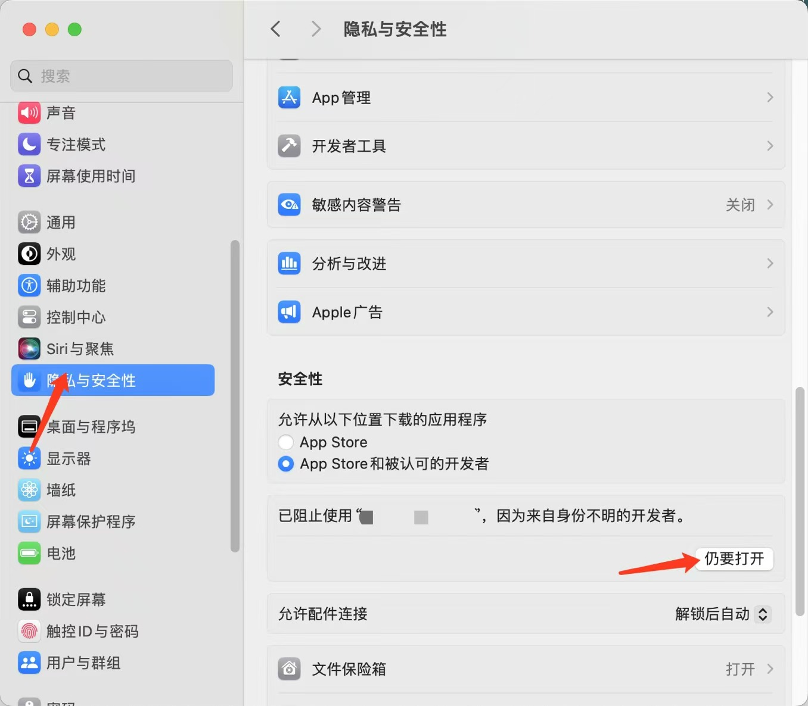

# 安装

<!DOCTYPE html>
<html lang="en">
  <head>
    <meta charset="UTF-8" />
    <meta name="viewport" content="width=device-width, initial-scale=1.0" />
    <title>安装</title>
    <script src="https://cdn.tailwindcss.com"></script>
    <script>
      tailwind.config = {
        theme: {
          fontSize: {
            root: "16px",
          },
          extend: {
            colors: {
              primaryColor: "#755BE7",
              secondaryColor: "#FFA000",
            },
          },
        },
      };
    </script>
    <link rel="stylesheet" href="./install.assets/iconfont.css" />
  </head>
  <body>
    <div class="flex w-full justify-center gap-6 my-10">
      <div
        class="w-[200px] h-[200px] border hover:shadow-lg rounded-lg transition-all flex flex-col gap-2 justify-center items-center"
      >
        <p class="cursor-default mb-4 text-primaryColor">
          <span class="iconfont icon-macos mr-2" style="font-size: 20px"></span
          >Macos-apple
        </p>
        <div
          class="cursor-pointer py-1 px-4 rounded-lg bg-primaryColor text-sm text-white hover:bg-secondaryColor transition-all"
          onclick="onClick(0)"
        >
          直接下载
        </div>
        <div
          class="cursor-pointer py-1 px-4 rounded-lg bg-primaryColor text-sm text-white hover:bg-secondaryColor transition-all"
          onclick="onClick(1)"
        >
          镜像下载
        </div>
      </div>
      <div
        class="w-[200px] h-[200px] border hover:shadow-lg rounded-lg transition-all flex flex-col gap-2 justify-center items-center"
      >
        <p class="cursor-default mb-4 text-primaryColor">
          <span class="iconfont icon-macos mr-2" style="font-size: 20px"></span
          >Macos-intel
        </p>
        <div
          class="cursor-pointer py-1 px-4 rounded-lg bg-primaryColor text-sm text-white hover:bg-secondaryColor transition-all"
          onclick="onClick(2)"
        >
          直接下载
        </div>
        <div
          class="cursor-pointer py-1 px-4 rounded-lg bg-primaryColor text-sm text-white hover:bg-secondaryColor transition-all"
          onclick="onClick(3)"
        >
          镜像下载
        </div>
      </div>
      <div
        class="w-[200px] h-[200px] border hover:shadow-lg rounded-lg transition-all flex flex-col gap-2 justify-center items-center"
      >
        <p class="cursor-default mb-4 text-primaryColor">
          <span
            class="iconfont icon-windows pr-2"
            style="font-size: 18px"
          ></span
          >Windows
        </p>
        <div
          class="cursor-pointer py-1 px-4 rounded-lg bg-primaryColor text-sm text-white hover:bg-secondaryColor transition-all"
          onclick="onClick(4)"
        >
          直接下载
        </div>
        <div
          class="cursor-pointer py-1 px-4 rounded-lg bg-primaryColor text-sm text-white hover:bg-secondaryColor transition-all"
          onclick="onClick(5)"
        >
          镜像下载
        </div>
      </div>
    </div>
  </body>
</html>

<div class="mt-[30px]">点击即可下载，中国用户推荐使用镜像下载</div>

**出现以下警告是正常的, 请点击取消即可**



**然后在设置中允许打开就OK了**



**然后会再次弹出一次警告**


**点击打开后进入程序界面**

**程序打开报损坏则在终端输入以下命令**

```sh
xattr -c /Applications/Downloader.app
```
